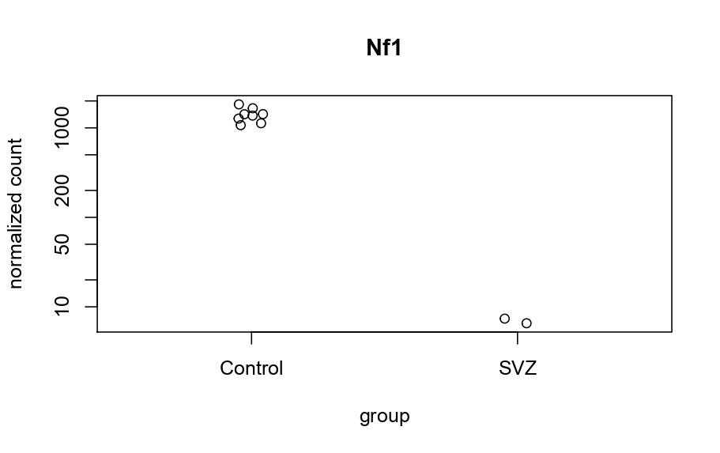
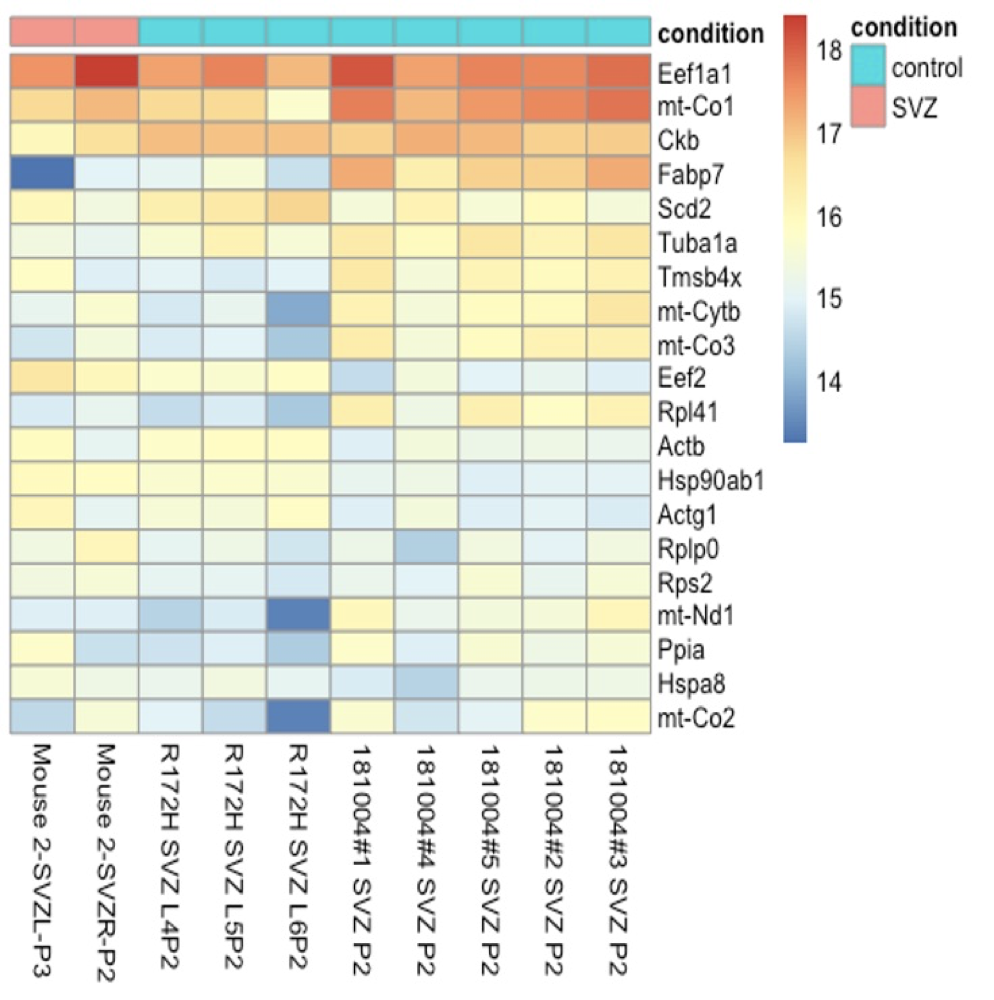
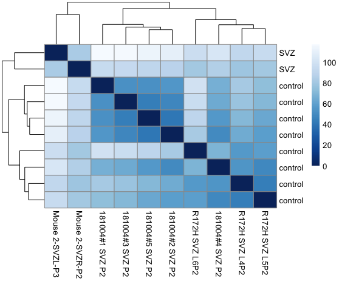
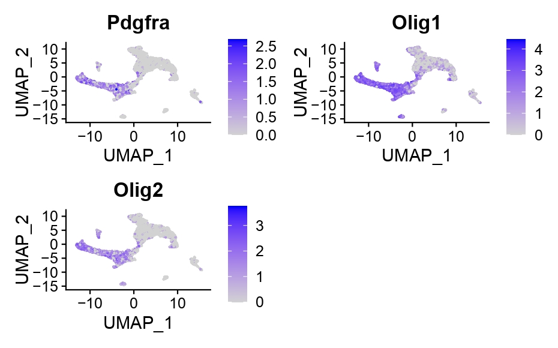
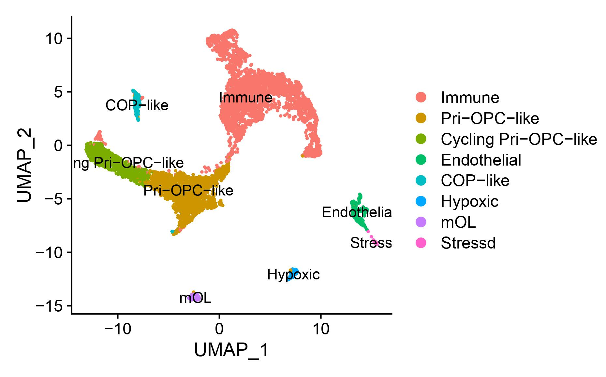
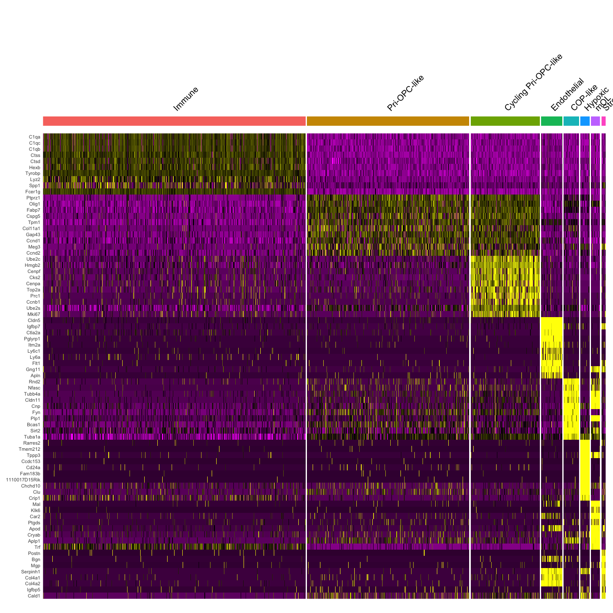

# Code-for-Sitong Chen
My code for R &amp; Linux &amp; Python

## R

### DESeq2
Differential Gene Expression analysis with DESeq2.

#### Import Salmon (pseudoaligner) counts
```

dir <- "Documents/lab/DEseq2/quants"
list.files(dir)
samples <- paste0("Mouse2_", c(seq(1,4)),"_quant")
files <- file.path(dir, samples, "quant.sf")
names(files) <-paste0(c('Mouse 2-SVZL-P3','Mouse 2-SVZR-P2','R172H SVZ L4P2','R172H SVZ L5P2','R172H SVZ L6P2','181004#1 SVZ P2','181004#4 SVZ P2','181004#5 SVZ P2','181004#2 SVZ P2','181004#3 SVZ P2')) # sample name
all(file.exists(files))
```
#### Reference gene-level annotation package
```
library(EnsDb.Mmusculus.v79)
txdb <- EnsDb.Mmusculus.v79
k <- keys(txdb, keytype = "TXNAME")
tx2gene <- select(txdb, k, "GENEID", "TXNAME")
```

#### Associated salmon output with annotation package

```
library(tximport)
txi <- tximport(files, type = "salmon", tx2gene = tx2gene, ignoreTxVersion = TRUE)
names(txi)
```

#### Creating a DESeq2 object
```
library(DESeq2)
sampleTable <- data.frame(condition = factor(c(rep("SVZ",2), rep("Control", 8)))
rownames(sampleTable) <- colnames(txi$counts)
dds <- DESeqDataSetFromTximport(txi, sampleTable, ~condition)
```

#### Differential expression analysis
```
dds <- DESeq(dds)
res <- results(dds, name="condition_treated_vs_untreated")
res <- results(dds, contrast=c("condition","treated","untreated"))
res
```

#### p-values and adjusted p-values
```
resOrdered <- res[order(res$pvalue),] 
summary(res)
sum(res$padj < 0.1, na.rm=TRUE) 
res01 <- results(dds, alpha=0.1) 
summary(res01)
```

#### MA-plot
Plot counts: examine the counts of reads for a single gene across the group 
```
plotMA(res, ylim=c(-2,2))
plotCounts(dds, gene=which.min(res$padj), intgroup="condition")
```


#### Export results to CSV files
```
write.csv(as.data.frame(resOrdered), 
          file="desktop/SVZ_control.csv")
```
          
#### Extracting transformed values
```
vsd <- vst(dds, blind=FALSE)
rld <- rlog(dds, blind=FALSE)
head(assay(vsd), 3)
```

#### Effects of transformations on the variance
standard deviation of transformed data, across samples, aginst the mean, using the shifted logarithm transformation)
```
ntd <- normTransform(dds)

library("vsn")
meanSdPlot(assay(ntd))

meanSdPlot(assay(vsd))

meanSdPlot(assay(rld))
```

#### Heatmap Visualization
Create a heatmap with converted Ensembl IDs to gene name. 
```
library("pheatmap")
df <- as.data.frame(colData(dds)[c("condition")])
rownames(df) <- colnames(dds)
pheatmap(assay(ntd)[select,], cluster_rows=FALSE, show_rownames=FALSE,
         cluster_cols=FALSE, annotation_col=df) # the gene you are interested in. 

mat <- assay(ntd)[select,],]
                      
library(biomaRt)
mart <- useMart("ensembl","mmusculus_gene_ensembl", host = 'uswest.ensembl.org', ensemblRedirect = FALSE)
gns <- getBM(c("external_gene_name","ensembl_gene_id"), "ensembl_gene_id", row.names(mat), mart)
row.names(mat)[match(gns[,2], row.names(mat))] <- gns[,1] #notice the order of geneiD and gene name
pheatmap(mat, show_rownames=TRUE, annotation_col=df,display_numbers =TRUE)        
```

#### Heatmap of the sample to sample distances
```
sampleDists <- dist(t(assay(vsd)))
library("RColorBrewer")
sampleDistMatrix <- as.matrix(sampleDists)
rownames(sampleDistMatrix) <- paste(vsd$condition, vsd$type)
colnames(sampleDistMatrix) <- NULL
colors <- colorRampPalette( rev(brewer.pal(9, "Blues")) )(255)
pheatmap(sampleDistMatrix,
         clustering_distance_rows=sampleDists,
         clustering_distance_cols=sampleDists,
         col=colors)
```


### Single-cell RNA-seq Analysis with Seurat 
#### Input the data (expression matrix)
```
a <- read.csv('/Users/chensitong/Desktop/sc/dpi25/dpi25.csv',header = T, row.names = 1)
cbmc.rna <- as.sparse(a) 
pbmc <- CreateSeuratObject(counts = cbmc.rna, project = 'dpi25', min.cells = 3, min.features = 200)
pbmc[["percent.mt"]] <- PercentageFeatureSet(pbmc, pattern = "^MT-")
```

#### expression level data without mt number 
```
VlnPlot(pbmc, features = c("nFeature_RNA", "nCount_RNA", "percent.mt"), ncol = 3)
```
#### Normalizing the data
```
pbmc <- NormalizeData(pbmc)
```
#### Identification of highly variable features (feature selection)
```
pbmc <- FindVariableFeatures(pbmc, selection.method = "vst", nfeatures = 2000)
```
#### Identify the 10 most highly variable genes
```
top10 <- head(VariableFeatures(pbmc), 10)
```

#### plot variable features with and without labels
```
plot1 <- VariableFeaturePlot(pbmc)
plot2 <- LabelPoints(plot = plot1, points = top10, repel = TRUE)
CombinePlots(plots = list(plot1, plot2))

all.genes <- rownames(pbmc)
pbmc <- ScaleData(pbmc, features = all.genes)
```

#### PCA
```
pbmc <- RunPCA(pbmc, features = VariableFeatures(object = pbmc))
print(pbmc[["pca"]], dims = 1:5, nfeatures = 5)
VizDimLoadings(pbmc, dims = 1:2, reduction = "pca")
DimPlot(pbmc, reduction = "pca")
DimHeatmap(pbmc, dims = 1, cells = 500, balanced = TRUE)
```

#### Determine the significant PCs
```
pbmc <- JackStraw(pbmc, num.replicate = 100)
pbmc <- ScoreJackStraw(pbmc, dims = 1:20)
JackStrawPlot(pbmc, dims = 1:15)
ElbowPlot(pbmc)
```
#### Clustering 
```
pbmc <- FindNeighbors(pbmc, dims = 1:10)
pbmc <- FindClusters(pbmc, resolution = 0.25)## resolution determine the number of cluster
```
#### UMAP
```
pbmc <- RunUMAP(pbmc, dims = 1:10)
DimPlot(pbmc, reduction = "umap")
```

####  Find markers for each cluster.
```
pbmc.markers <- FindAllMarkers(pbmc, only.pos = TRUE, min.pct = 0.25, logfc.threshold = 0.25)
pbmc.markers %>% group_by(cluster) %>% top_n(n = 2, wt = avg_logFC)
cluster1.markers <- FindMarkers(pbmc, ident.1 = 0, logfc.threshold = 0.25, test.use = "roc", only.pos = TRUE)
VlnPlot(pbmc, features = c('Cd3','Cd19'))##marker 
FeaturePlot(pbmc, features = c('Pdgfra','Olig1','Olig2')
```



```
top10 <- pbmc.markers %>% group_by(cluster) %>% top_n(n = 10, wt = avg_logFC)


new.cluster.ids <- c('Immune','Pri-OPC-like','Cycling Pri-OPC-like','Endothelial','COP-like','Hypoxic','mOL','Stressd',)
names(new.cluster.ids) <- levels(pbmc)
pbmc <- RenameIdents(pbmc, new.cluster.ids)
DimPlot(pbmc, reduction = "umap", label = TRUE, pt.size = 0.5) 
```


```
DoHeatmap(pbmc, features = top10$gene) 
```

### Convert Ensembl ID to gene name. 
input the file.
```
ID <- read.csv('Desktop/Control_control.csv')
```
#### Convert mouse ensembl_gene_id to mouse gene name 
```
library('biomaRt')
mart <- useMart("ensembl","mmusculus_gene_ensembl", host = 'uswest.ensembl.org', ensemblRedirect = FALSE)
genes <- ID$X
mgi <- getBM( attributes= c("ensembl_gene_id",'mgi_symbol'),values=genes,mart= mart,filters= "ensembl_gene_id")
```
#### Convert mouse gene name to human gene name
```
library(biomaRt)
human = useMart("ensembl", dataset = "hsapiens_gene_ensembl")
mouse = useMart("ensembl", dataset = "mmusculus_gene_ensembl")
genes = mgi$mgi_symbol
genes = getLDS(attributes = c("mgi_symbol"), filters = "mgi_symbol", values = genes ,mart = mouse, attributesL = c("hgnc_symbol"), martL = human, uniqueRows=T)
```

### GSEA prerank input file generation. 
After DEG analysis, I will use GSEA prerank to the enrichment analysis. Here is the code for the GSEA input file.
```
f$fcsign <- sign(f$log2FoldChange)
f$logP <- -log10(f$pvalue)
f$metric = f$logP/f$fcsign
y <- f[,c('hgnc_symbol','metric')]
y <- na.omit(y)
write.table(y,file="desktop/SVZ_control.rnk",quote=F,sep="\t",row.names=F)
```

## Linux 

All of the process running in HPC

### Variance calling
#### BWA mapping 
```
for id in /groups/ligrp/sitongchen/scrna/sc/*_1.fastq.gz
do
date
filename=$(basename ${id} _1.fastq.gz)
filepath=${id%/*}; echo "BWA mapping for ${filename}"
bwa mem -M -t 20 /groups/ligrp/sitongchen/scrna/22/GRCm38_68.fa ${filepath}/${filename}_1.fastq.gz ${filepath}/${filename}_2.fastq.gz > groups/ligrp/sitongchen/scrna/dpi35/result/sam/${filename}.sam
```
#### Sort sam files

```
date
echo "Sort sam file"
gatk SortSam \
--INPUT /groups/ligrp/sitongchen/scrna/sam/${filename}.sam \
--OUTPUT /groups/ligrp/sitongchen/scrna/sortbam/${filename}_sorted.bam \
--SORT_ORDER coordinate
if [ /groups/ligrp/sitongchen/scrna/sortbam/${filename}_sorted.bam -s ]; then
rm -f /groups/ligrp/sitongchen/scrna/sam/${filename}.sam
fi
```

#### Marking duplicates
```
date
echo "Marking duplicates"
gatk MarkDuplicates \
--INPUT /groups/ligrp/sitongchen/scrna/sortbam/${filename}_sorted.bam \
--METRICS_FILE /groups/ligrp/sitongchen/scrna/sortbam/${filename}_dupMetrics \
--OUTPUT /groups/ligrp/sitongchen/scrna/sortbam/${filename}_sorted_dupMarked.bam
if [ /groups/ligrp/sitongchen/scrna/sortbam/${filename}_sorted_dupMarked.bam -s ]; then
rm -f /groups/ligrp/sitongchen/scrna/sortbam/${filename}_sorted.bam
fi
```
##### Repairing Readgroups
```
    date
    echo "Repairing Readgroups";
    gatk AddOrReplaceReadGroups \
    --INPUT /groups/ligrp/sitongchen/scrna/sortbam/${filename}_sorted_dupMarked.bam \
    --OUTPUT /groups/ligrp/sitongchen/scrna/sortbam/${filename}_sorted_DM_RG.bam \
    --RGLB illumina_${filename} \
    --RGPL illumina \
    --RGPU JR001 \
    --RGSM ${filename}
```

#### First recalibration table

```
gatk BaseRecalibrator \
--input /groups/ligrp/sitongchen/scrna/sortbam/${filename}_sorted_DM_RG.bam \
--known-sites /groups/ligrp/sitongchen/scrna/22/mgp.v3.snps.rsIDdbSNPv137.vcf.gz \
--output /groups/ligrp/sitongchen/scrna/sortbam/${filename}_recal.table \
--reference /groups/ligrp/sitongchen/scrna/22/GRCm38_68.fa

gatk ApplyBQSR \
        -R /groups/ligrp/sitongchen/scrna/22/GRCm38_68.fa \
        -I  /groups/ligrp/sitongchen/scrna/sortbam/${filename}_sorted_DM_RG.bam \
        --bqsr-recal-file /groups/ligrp/sitongchen/scrna/sortbam/${filename}_recal.table \
        -O  /groups/ligrp/sitongchen/scrna/sortbam/${filename}_BR.bam
```
#### VCF file generation
```
gatk Mutect2 \
-R /groups/ligrp/sitongchen/scrna/22/GRCm38_68.fa \
-I /groups/ligrp/sitongchen/scrna/sortbam/${filename}_BR.bam \
-O /groups/ligrp/sitongchen/scrna/gatk/${filename}_raw.vcf.gz

```

#### BCFtool Variance calling 
```
for id in /groups/ligrp/sitongchen/scrna/dpi35/result/sortbam/*_BR.bam
do
    filename=$(basename ${id} _BR.bam)
    echo "  -->  process:  $filename"
    bcftools mpileup --threads 10 -q 20 -Ou -f /groups/ligrp/sitongchen/scrna/22/GRCm38_68.fa  /groups/ligrp/sitongchen/scrna/dpi35/result/sortbam/${filename}_BR.bam | bcftools call --threads 4 -mv -Ov  > /groups/ligrp/sitongchen/scrna/dpi35/result/bcfs/${filename}.raw.vcf
done
```

#### scSplitter
scSplitter is a preprocessing tool designed to convert scRNA seq results into a format suitable for mutation or SNV calling at the single cell level for the purpose of lineage tracing.

```
STAR --runMode genomeGenerate --genomeDir /groups/ligrp/sitongchen/scrna/dpi35  --genomeFastaFiles /groups/ligrp/sitongchen/scrna/22/mm10.fa --sjdbGTFfile /groups/ligrp/sitongchen/scrna/22/mm10.refGene.gtf -- sjdbOverhang 199

python3 scSplitter.py --ig True --f /groups/ligrp/sitongchen/scrna/dpi35/gel_barcode1_list.txt --i /groups/ligrp/sitongchen/scrna/dpi35/fastqs --r /groups/ligrp/sitongchen/scrna/dpi35/result --ind /groups/ligrp/sitongchen/scrna/dpi35/sta
STAR --runMode genomeGenerate --genomeDir /groups/ligrp/sitongchen/scrna/dpi35  --genomeFastaFiles /groups/ligrp/sitongchen/scrna/22/mm10.fa --sjdbGTFfile /groups/ligrp/sitongchen/scrna/22/mm10.refGene.gtf -- sjdbOverhang 199

```
## Python

### Salmon
Salmon is a  Fast, accurate and bias-aware software for transcript quantification from RNA-seq data.

#### Generate index 

```
salmon index -t athal.fa.gz -i athal_index
```
#### Quantify Sample
```
for fn in raw_data/S{13..20};
do
samp=`basename ${fn}`
echo "Processing sample ${samp}"
salmon quant --validateMappings -i Mus_musculus.GRCm38.cdna.all_index -l A \
         -1 raw_data/${samp}_1.fq.gz \
         -2 raw_data/${samp}_2.fq.gz \
         -p 8 -o quants/${samp}_quant
done 
```

#### Create heatmap 
```
plt.tight_layout()
plt.figure(figsize=(100, 600))
df = pd.read_csv('desktop/gbm1.csv',index_col=0)
names_rows =pd.read_csv('desktop/gbm1.csv',usecols = [0])
list = names_rows.values.tolist()


linkage_matrix = linkage(df, 'ward')
dendrogram(
  linkage_matrix,
  labels=list
)
plt.tight_layout()
plt.savefig('dpi35.pdf',dpi=300)


g = sns.clustermap(df, figsize=(25, 20), method='ward')
plt.savefig('desktop/lineage_tree_AF_Filter1.pdf', dpi=300 ,bbox_inches='tight')
```

