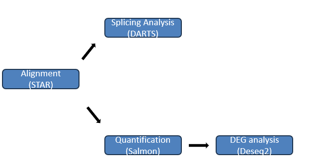
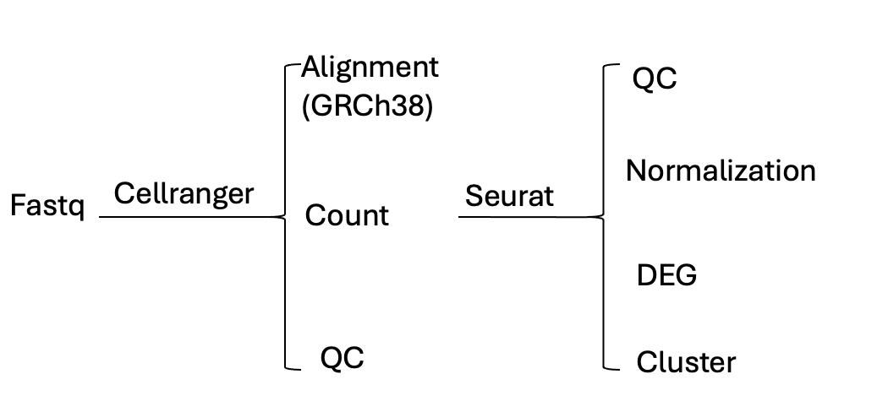

# Srcipts for Sitong Chen
This repository contains a comprehensive set of scripts and tools for analyzing RNA-seq, single-cell RNA-seq (SC-RNAseq), whole genome sequencing (WGS) data, machine learning, and various other tasks.

## Project introduce

**RNA-seq Analysis**: Tools and scripts for processing and analyzing bulk RNA sequencing data.[RNA scripts](./Scripts/RNA-seq/)

**SC-RNAseq Analysis**: Methods for analyzing single-cell RNA sequencing data, including clustering and differential expression analysis.[SC-RNA scripts](./Scripts/SC-RNA/)

**Whole Genome Sequencing (WGS) Analysis**: Pipelines for variant calling, genome assembly, and other WGS tasks.[WGS scripts](./Scripts/WGS/)

**Machine Learning**: Machine learning models for classification, regression, and clustering of omics data.[ML scripts](./Scripts/Scripts/machine_learning/)

**Miscellaneous Tasks**: Scripts for various random tasks related to omics data analysis.[other scripts](./Scripts/Random_task/) 

All of the scripts are available in the **Scripts/** folder. 

## Requirements 

**Basic Requirements**: Python, R, Bash, reference genome. 

**RNA-seq Analysis**: STAR, Salmon, DESeq2, DARTS, Leafcutter, rMATS, Snakemake. 

**SC-RNAseq Analysis**: cellranger, Seurat.

**Whole Genome Sequencing (WGS) Analysis**: BWA, GATK, bcftools.

**Machine Learning**: tensorflow, Enformer. 

## RNA-seq pipeline

Besides the softwares were mentions in the pipeline, this part also include 2 other splicing variant softwares, rMATS and Leafcutter. 

It also provided the **Snakemake** version. 

## scRNA-seq pipeline

## Contributors
Author: Sitong Chen

Email: sitong9602@outlook.com

