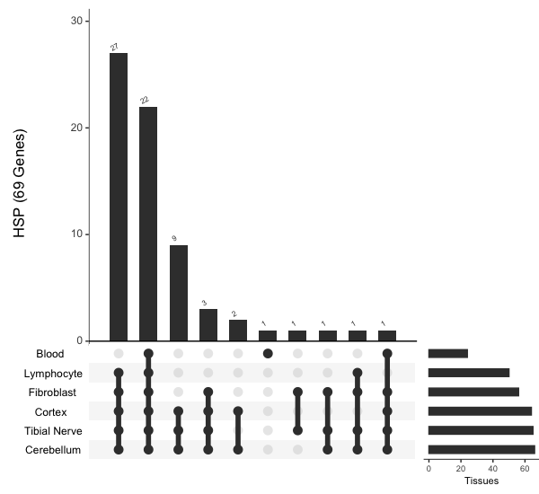

# Code-for-Sitong Chen


## RNA-seq pipeline


All of the scripts are available in **Scripts/RNA-seq/**. 

Besides the softwares were mentions in the pipeline, this part also include 2 other splicing variant softwares, rMATS and Leafcutter. 

It also provided the **Snakemake** version. 


### Convert Ensembl ID to gene name. 
input the file.
```
ID <- read.csv('Desktop/Control_control.csv')
```
#### Convert mouse ensembl_gene_id to mouse gene name 
```
library('biomaRt')
mart <- useMart("ensembl","mmusculus_gene_ensembl", host = 'uswest.ensembl.org', ensemblRedirect = FALSE)
genes <- ID$X
mgi <- getBM( attributes= c("ensembl_gene_id",'mgi_symbol'),values=genes,mart= mart,filters= "ensembl_gene_id")
```
#### Convert mouse gene name to human gene name
```
library(biomaRt)
human = useMart("ensembl", dataset = "hsapiens_gene_ensembl")
mouse = useMart("ensembl", dataset = "mmusculus_gene_ensembl")
genes = mgi$mgi_symbol
genes = getLDS(attributes = c("mgi_symbol"), filters = "mgi_symbol", values = genes ,mart = mouse, attributesL = c("hgnc_symbol"), martL = human, uniqueRows=T)
```

### GSEA prerank input file generation. 
After DEG analysis, I will use GSEA prerank to the enrichment analysis. Here is the code for the GSEA input file.
```
f$fcsign <- sign(f$log2FoldChange)
f$logP <- -log10(f$pvalue)
f$metric = f$logP/f$fcsign
y <- f[,c('hgnc_symbol','metric')]
y <- na.omit(y)
write.table(y,file="desktop/SVZ_control.rnk",quote=F,sep="\t",row.names=F)
```
#### Upset plot 
Base on the requirement, I need to move the bar plot to the right and redefine the upset package in R.
```
library(UpSetR)
library(grid)
library(gridExtra)
library(ggplot2)

NoAttBasePlot <- function (legend, size_plot_height, Main_bar_plot, Matrix_plot, 
    hratios, Size_plot, query_legend, set_metadata, set_metadata_plots, 
    newpage) {
    top <- 1
    bottom <- 100
    if ((!is.null(legend)) && (query_legend != tolower("none"))) {
        if (query_legend == tolower("top")) {
            top <- 3
            bottom <- 102
            legend_top <- 1
            legend_bottom <- 3
            size_plot_height <- (size_plot_height + 2)
        }
        else if (query_legend == tolower("bottom")) {
            legend_top <- 101
            legend_bottom <- 103
        }
    }
    if (is.null(set_metadata)) {
        matrix_and_mainbar_right <- 100
        matrix_and_mainbar_left <- 21
        size_bar_right <- 20
        size_bar_left <- 1
    }
    else if (!is.null(set_metadata)) {
        matrix_and_mainbar_right <- set_metadata$ncols + 100
        matrix_and_mainbar_left <- set_metadata$ncols + 21
        size_bar_right <- set_metadata$ncols + 20
        size_bar_left <- set_metadata$ncols + 1
        metadata_right <- set_metadata$ncols
        metadata_left <- 1
    }
    if (newpage) {
        grid::grid.newpage()
    }
    if ((!is.null(legend)) && (query_legend != tolower("none"))) {
        if (query_legend == tolower("top")) {
            pushViewport(viewport(layout = grid.layout(102, matrix_and_mainbar_right)))
        }
        else if (query_legend == tolower("bottom")) {
            pushViewport(viewport(layout = grid.layout(103, matrix_and_mainbar_right)))
        }
    }
    else if ((is.null(legend)) || (query_legend == tolower("none"))) {
        pushViewport(viewport(layout = grid.layout(100, matrix_and_mainbar_right)))
    }
    # Modified
    vp = UpSetR:::vplayout(top:bottom, 1:(matrix_and_mainbar_right-matrix_and_mainbar_left))
    pushViewport(vp)
    grid.draw(arrangeGrob(Main_bar_plot, Matrix_plot, heights = hratios))
    popViewport()
    # Modified
    vp = UpSetR:::vplayout(size_plot_height:bottom, (matrix_and_mainbar_right-matrix_and_mainbar_left-1):96)
    pushViewport(vp)
    grid.draw(arrangeGrob(Size_plot))
    popViewport()
    if (!is.null(set_metadata)) {
        for (i in 1:length(set_metadata_plots)) {
            if (i != 1) {
                metadata_left <- 1 + metadata_right
                metadata_right <- metadata_right + set_metadata$plots[[i]]$assign
            }
            else {
                metadata_left <- 1
                metadata_right <- set_metadata$plots[[i]]$assign
            }
            vp = UpSetR:::vplayout(size_plot_height:bottom, metadata_left:metadata_right)
            pushViewport(vp)
            grid.draw(arrangeGrob(set_metadata_plots[[i]]))
            popViewport()
        }
    }
    if ((!is.null(legend)) && (query_legend != tolower("none"))) {
        vp = UpSetR:::vplayout(legend_top:legend_bottom, matrix_and_mainbar_left:matrix_and_mainbar_right)
        pushViewport(vp)
        grid.draw(arrangeGrob(legend))
        popViewport()
    }
}

Make_size_plot <- function (Set_size_data, sbar_color, ratios, ylabel, scale_sets, 
    text_scale, set_size_angle, set_size.show, set_size.scale_max, 
    set_size.number_size) {
    if (length(text_scale) > 1 && length(text_scale) <= 6) {
        x_axis_title_scale <- text_scale[3]
        x_axis_tick_label_scale <- text_scale[4]
    }
    else {
        x_axis_title_scale <- text_scale
        x_axis_tick_label_scale <- text_scale
    }
    if (ylabel == "Set Size" && scale_sets != "identity") {
        ylabel <- paste("Set Size", paste0("( ", 
            scale_sets, " )"))
        if (scale_sets == "log2") {
            Set_size_data$y <- log2(Set_size_data$y)
        }
        if (scale_sets == "log10") {
            Set_size_data$y <- log10(Set_size_data$y)
        }
    }
    if (!is.null(set_size.number_size)) {
        num.size <- (set_size.number_size/2.845276) * x_axis_tick_label_scale
    }
    else {
        num.size <- (7/2.845276) * x_axis_tick_label_scale
    }
    Size_plot <- (ggplot(data = Set_size_data, aes_string(x = "x", 
        y = "y")) + geom_bar(stat = "identity", colour = sbar_color, 
        width = 0.4, fill = sbar_color, position = "identity") + 
        scale_x_continuous(limits = c(0.5, (nrow(Set_size_data) + 
            0.5)), breaks = c(0, max(Set_size_data)), expand = c(0, 
            0)) + theme(panel.background = element_rect(fill = "white"), 
        plot.margin = unit(c(-0.11, -1.3, 0.5, 0.5), "lines"), 
        axis.title.x = element_text(size = 8.3 * x_axis_title_scale), 
        axis.text.x = element_text(size = 7 * x_axis_tick_label_scale, 
            vjust = 1, hjust = 0.5), axis.line = element_line(colour = "gray0"), 
        axis.line.y = element_blank(), axis.line.x = element_line(colour = "gray0", 
            size = 0.3), axis.text.y = element_blank(), axis.ticks.y = element_blank(), 
        panel.grid.minor = element_blank(), panel.grid.major = element_blank()) + 
        xlab(NULL) + ylab(ylabel) + coord_flip())
    if (set_size.show == TRUE) {
        Size_plot <- (Size_plot + geom_text(aes(label = y, vjust = 0.5, 
            hjust = 1.2, angle = set_size_angle), size = num.size))
    }
    if (scale_sets == "log10") {
        if (!is.null(set_size.scale_max)) {
            Size_plot <- (Size_plot + scale_y_continuous(limits = c(set_size.scale_max, 
                0), trans = log10_reverse_trans()))
        }
        else {
            Size_plot <- (Size_plot + scale_y_continuous(trans = log10_reverse_trans()))
        }
    }
    else if (scale_sets == "log2") {
        if (!is.null(set_size.scale_max)) {
            Size_plot <- (Size_plot + scale_y_continuous(limits = c(set_size.scale_max, 
                0), trans = log2_reverse_trans()))
        }
        else {
            Size_plot <- (Size_plot + scale_y_continuous(trans = log2_reverse_trans()))
        }
    }
    else {
        if (!is.null(set_size.scale_max)) {
            Size_plot <- (Size_plot + scale_y_continuous(limits = c(set_size.scale_max, 
                0), trans = "reverse"))
        }
        else {
            # Modified
            #Size_plot <- (Size_plot + scale_y_continuous(trans = "reverse"))
        }
    }
    Size_plot <- ggplot_gtable(ggplot_build(Size_plot))
    return(Size_plot)
}

assignInNamespace(x="NoAttBasePlot", value=NoAttBasePlot, ns="UpSetR")
assignInNamespace(x="Make_size_plot", value=Make_size_plot, ns="UpSetR")
```

Then modified the dataframe to create the upset plot.
```
cmt_up <- read.csv('cmt_per99.csv')
colnames(cmt_up)[2:7]<- c('Blood',	'Cortex','Cerebellum',	'Fibroblast',	'Lymphocyte',	'Tibial Nerve')
selected_columns <- colnames(cmt_up[2:7])
for (col in selected_columns) {
  cmt_up[[col]] <- ifelse(!is.na(cmt_up[[col]]), 1, cmt_up[[col]])
}

cmt_up<- as.data.frame(cmt_up)
cmt_up[is.na(cmt_up)] <- 0

upset(cmt_up, nsets = 6, number.angles = 30,  point.size = 3.5, line.size = 2, 
      mainbar.y.label = "CMT (155 Genes)", sets.x.label = "Tissues", 
      text.scale = c(1.5, 1.3, 1, 1, 1.3, 1), order.by = "freq")
```


## Linux 

All of the process running in HPC

### Variance calling
#### BWA mapping 
```
for id in /groups/ligrp/sitongchen/scrna/sc/*_1.fastq.gz
do
date
filename=$(basename ${id} _1.fastq.gz)
filepath=${id%/*}; echo "BWA mapping for ${filename}"
bwa mem -M -t 20 /groups/ligrp/sitongchen/scrna/22/GRCm38_68.fa ${filepath}/${filename}_1.fastq.gz ${filepath}/${filename}_2.fastq.gz > groups/ligrp/sitongchen/scrna/dpi35/result/sam/${filename}.sam
```
#### Sort sam files

```
date
echo "Sort sam file"
gatk SortSam \
--INPUT /groups/ligrp/sitongchen/scrna/sam/${filename}.sam \
--OUTPUT /groups/ligrp/sitongchen/scrna/sortbam/${filename}_sorted.bam \
--SORT_ORDER coordinate
if [ /groups/ligrp/sitongchen/scrna/sortbam/${filename}_sorted.bam -s ]; then
rm -f /groups/ligrp/sitongchen/scrna/sam/${filename}.sam
fi
```

#### Marking duplicates
```
date
echo "Marking duplicates"
gatk MarkDuplicates \
--INPUT /groups/ligrp/sitongchen/scrna/sortbam/${filename}_sorted.bam \
--METRICS_FILE /groups/ligrp/sitongchen/scrna/sortbam/${filename}_dupMetrics \
--OUTPUT /groups/ligrp/sitongchen/scrna/sortbam/${filename}_sorted_dupMarked.bam
if [ /groups/ligrp/sitongchen/scrna/sortbam/${filename}_sorted_dupMarked.bam -s ]; then
rm -f /groups/ligrp/sitongchen/scrna/sortbam/${filename}_sorted.bam
fi
```
##### Repairing Readgroups
```
    date
    echo "Repairing Readgroups";
    gatk AddOrReplaceReadGroups \
    --INPUT /groups/ligrp/sitongchen/scrna/sortbam/${filename}_sorted_dupMarked.bam \
    --OUTPUT /groups/ligrp/sitongchen/scrna/sortbam/${filename}_sorted_DM_RG.bam \
    --RGLB illumina_${filename} \
    --RGPL illumina \
    --RGPU JR001 \
    --RGSM ${filename}
```

#### First recalibration table

```
gatk BaseRecalibrator \
--input /groups/ligrp/sitongchen/scrna/sortbam/${filename}_sorted_DM_RG.bam \
--known-sites /groups/ligrp/sitongchen/scrna/22/mgp.v3.snps.rsIDdbSNPv137.vcf.gz \
--output /groups/ligrp/sitongchen/scrna/sortbam/${filename}_recal.table \
--reference /groups/ligrp/sitongchen/scrna/22/GRCm38_68.fa

gatk ApplyBQSR \
        -R /groups/ligrp/sitongchen/scrna/22/GRCm38_68.fa \
        -I  /groups/ligrp/sitongchen/scrna/sortbam/${filename}_sorted_DM_RG.bam \
        --bqsr-recal-file /groups/ligrp/sitongchen/scrna/sortbam/${filename}_recal.table \
        -O  /groups/ligrp/sitongchen/scrna/sortbam/${filename}_BR.bam
```
#### VCF file generation
```
gatk Mutect2 \
-R /groups/ligrp/sitongchen/scrna/22/GRCm38_68.fa \
-I /groups/ligrp/sitongchen/scrna/sortbam/${filename}_BR.bam \
-O /groups/ligrp/sitongchen/scrna/gatk/${filename}_raw.vcf.gz

```

#### BCFtool Variance calling 
```
for id in /groups/ligrp/sitongchen/scrna/dpi35/result/sortbam/*_BR.bam
do
    filename=$(basename ${id} _BR.bam)
    echo "  -->  process:  $filename"
    bcftools mpileup --threads 10 -q 20 -Ou -f /groups/ligrp/sitongchen/scrna/22/GRCm38_68.fa  /groups/ligrp/sitongchen/scrna/dpi35/result/sortbam/${filename}_BR.bam | bcftools call --threads 4 -mv -Ov  > /groups/ligrp/sitongchen/scrna/dpi35/result/bcfs/${filename}.raw.vcf
done
```

#### scSplitter
scSplitter is a preprocessing tool designed to convert scRNA seq results into a format suitable for mutation or SNV calling at the single cell level for the purpose of lineage tracing.

```
STAR --runMode genomeGenerate --genomeDir /groups/ligrp/sitongchen/scrna/dpi35  --genomeFastaFiles /groups/ligrp/sitongchen/scrna/22/mm10.fa --sjdbGTFfile /groups/ligrp/sitongchen/scrna/22/mm10.refGene.gtf -- sjdbOverhang 199

python3 scSplitter.py --ig True --f /groups/ligrp/sitongchen/scrna/dpi35/gel_barcode1_list.txt --i /groups/ligrp/sitongchen/scrna/dpi35/fastqs --r /groups/ligrp/sitongchen/scrna/dpi35/result --ind /groups/ligrp/sitongchen/scrna/dpi35/sta
STAR --runMode genomeGenerate --genomeDir /groups/ligrp/sitongchen/scrna/dpi35  --genomeFastaFiles /groups/ligrp/sitongchen/scrna/22/mm10.fa --sjdbGTFfile /groups/ligrp/sitongchen/scrna/22/mm10.refGene.gtf -- sjdbOverhang 199

```

#### GATK liftOver

liftOver a VCF file from one reference build to another.

In my case, I will liftover GRCh38 to hg19. You need to download the hg19.fa and hg38ToHg19.over.chain file for this step. Based on the size of the ref, you may need a instance with large RAM. 

```
java -Xmx370G -jar picard.jar  LiftoverVcf --CHAIN hg38ToHg19.over.chain --INPUT gnomad.genomes.v4.1.sites.chr${data}.vcf  --OUTPUT chr${data}.vcf --REFERENCE_SEQUENCE hg19.fa --REJECT reject.vcf
```


## Python

### Salmon
Salmon is a  Fast, accurate and bias-aware software for transcript quantification from RNA-seq data.

#### Generate index 

```
salmon index -t Mus_musculus.GRCm38.cdna.all.fa.gz -i Mus_musculus.GRCm38.cdna.all_index
```
#### Quantify Sample
```
for fn in raw_data/S{11..20};
do
samp=`basename ${fn}`
echo "Processing sample ${samp}"
salmon quant --validateMappings -i Mus_musculus.GRCm38.cdna.all_index -l A \
         -1 raw_data/${samp}_1.fq.gz \
         -2 raw_data/${samp}_2.fq.gz \
         -p 8 -o quants/${samp}_quant
done 
```

#### Create heatmap 
```
plt.tight_layout()
plt.figure(figsize=(100, 600))
df = pd.read_csv('desktop/gbm1.csv',index_col=0)
names_rows =pd.read_csv('desktop/gbm1.csv',usecols = [0])
list = names_rows.values.tolist()


linkage_matrix = linkage(df, 'ward')
dendrogram(
  linkage_matrix,
  labels=list
)
plt.tight_layout()
plt.savefig('dpi35.pdf',dpi=300)


g = sns.clustermap(df, figsize=(25, 20), method='ward')
plt.savefig('desktop/lineage_tree_AF_Filter1.pdf', dpi=300 ,bbox_inches='tight')
```

